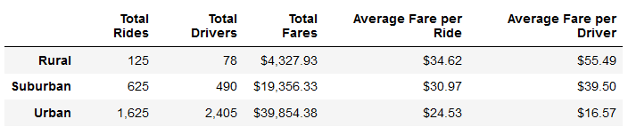
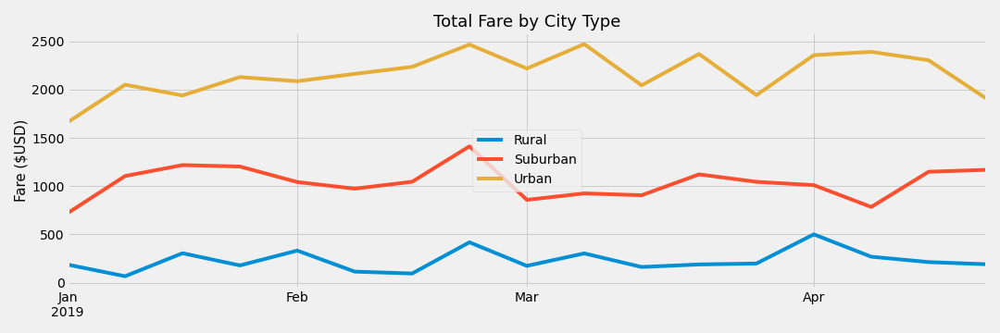

# PyBer_Analysis

## Introduction 
Ridesharing data can tell us a lot about how people are getting around in a specific area. This project utilizes pandas and matplotlib in python to analyze and visualize ridesharing data across various areas. The data is broken down into a data frame by city, date, fare, ride_id, driver_count, and location type. Utilizing data cleaning and matplotlib fares paid per month per each ride location type was visualized. 

## Results
By utilizing pandas’ data frames and data cleaning methods, this project was able to extract the following information.

### Ride-sharing data include the total rides, total drivers, total fares, average fare per ride and driver, and total fare by city type.

Using a further data cleaning and matplotlib a table line graph was created to demonstrate the relation between ride share location types, fare prices given by date. 

### Ride share information given by date

## Summary 
Based on the former analysis the following recommendations are presented for consideration to optimize ride share practices. Prioritize service in urban areas where over 68% of rides occur. Have incentives for customers to use ride share more in January and March to increase fairs for those months. Finally, it is advised that incentives are given to drivers at the end of February for bringing in more fares.
